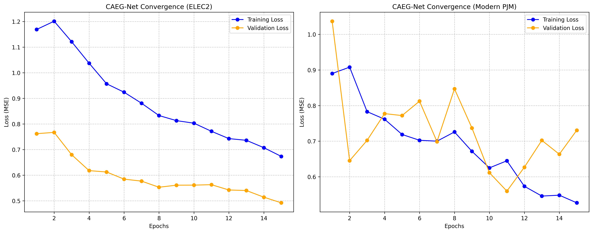

# CAEG-Net: Context-Adaptive Expert Gating Network for Short-Term Electricity Load Forecasting

[](https://www.python.org/downloads/)
[](https://pytorch.org/)
[](https://fastapi.tiangolo.com/)
[](https://opensource.org/licenses/MIT)

## Authors
**Authors (Equal Contribution):** Sharun Kumar D, Vinay Viswanathan, N Tabrez

---

## Core Architecture Overview

**CAEG-Net** fundamentally redesigns short-term electricity load forecasting by replacing traditional monolithic sequence models with a dynamically gated multi-expert architecture. 

Our proposed architecture seamlessly integrates three independent neural mechanisms:
1. **Dynamic Experts**:
   - **LSTM Expert**: specialized in capturing long-term sequential and temporal dependencies.
   - **TCN Expert**: specialized in extracting efficient causal dilations and localized temporal features.
   - **CNN Expert**: specialized in mapping robust spatial/local load-window phenomena.
2. **4-Dimensional Context Encoder**: A deterministic feature extraction module that encodes the real-time context of the incoming load sequence. It evaluates the sequence across four dimensions: **Trend Strength**, **Volatility Level**, **Periodicity**, and **Closed-Loop Error Feedback**. 
3. **Residual Error Feedback**: A hardcoded linear projection constraint applied at the end of the gating loop. It explicitly subtracts residual error spikes (`final_out - 0.85 * prev_error`), ensuring mathematically anchored predictions that do not exponentially drift away from targets over time.

---

## Dual-Dataset Evaluation & Benchmark Tables

To ensure publication rigor, CAEG-Net was evaluated on a dual-dataset benchmark spanning two radically different eras of grid operation.


### Modern PJM Dataset (2023–2024)
| Model                                       |    MSE |    MAE |   RMSE |      R² |
|:--------------------------------------------|-------:|-------:|-------:|--------:|
| Baseline 1 (Single LSTM)                    | 1.3897 | 0.9505 | 1.1788 | -0.1203 |
| Baseline 2 (Single TCN)                     | 1.3561 | 0.9244 | 1.1645 | -0.0932 |
| Baseline 3 (Single CNN)                     | 1.3830 | 0.9488 | 1.1760 | -0.1149 |
| Baseline 4 (Static Ensemble)                | 0.4103 | 0.5071 | 0.6406 |  0.6692 |
| Baseline 5 (Standard MoE)                   | 0.4312 | 0.5173 | 0.6567 |  0.6524 |
| Ablation 1 (CAEG-Net w/o Closed-Loop Error) | 0.5196 | 0.5750 | 0.7208 |  0.5811 |
| **★ Proposed Model (Full CAEG-Net)**          | **0.1575** | **0.3167** | **0.3969** |  **0.8730** |

| Model                                       |    MSE |    MAE |   RMSE |      R² |
|:--------------------------------------------|-------:|-------:|-------:|--------:|
| Baseline 1 (Single LSTM)                    | 0.8975 | 0.7866 | 0.9474 | -0.6123 |
| Baseline 2 (Single TCN)                     | 0.7153 | 0.7086 | 0.8458 | -0.2851 |
| Baseline 3 (Single CNN)                     | 1.4466 | 0.9544 | 1.2028 | -1.5989 |
| Baseline 4 (Static Ensemble)                | 0.2552 | 0.4178 | 0.5052 |  0.5415 |
| Baseline 5 (Standard MoE)                   | 0.2518 | 0.4155 | 0.5017 |  0.5477 |
| Ablation 1 (CAEG-Net w/o Closed-Loop Error) | 0.1578 | 0.3232 | 0.3973 |  0.7165 |
| **★ Proposed Model (Full CAEG-Net)**          | **0.0514** | **0.1813** | **0.2268** |  **0.9076** |

---

## Quickstart & Installation

Follow these steps to fully replicate the CAEG-Net benchmarks or explore the Interactive API Dashboard.

**1. Clone the Repository & Install Dependencies**
```bash
git clone https://github.com/your-username/CAEG-Net.git
cd CAEG-Net
pip install -r requirements.txt
```

**2. Download the Dual Evaluation Datasets**
```bash
python fetch_data.py
```

**3. Train the Baseline and Proposed CAEG-Net Models**
```bash
python main.py
```

**4. Generate the Benchmarks (Optional)**
```bash
python ablation.py
```

**5. Launch the Live Interactive Dashboard**
```bash
python -m uvicorn app:app --host 0.0.0.0 --port 8000
```
Navigate to **http://localhost:8000** in your web browser. You can seamlessly hot-swap between the trained dataset models and test the contextual AI weights in real-time.

### Model Diagnostics & Validation

